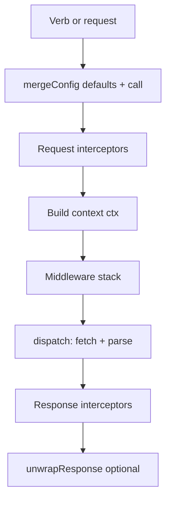

# Project flow and file map

This document explains how **@hamdymohamedak/openfetch** handles a single HTTP call, which files participate, and how data moves between layers.

## Directory layout

Layers are separated so **domain** stays free of `fetch`, **transport** owns I/O, **runtime** orchestrates the pipeline, **shared** holds pure helpers, and **plugins** / **sugar** extend the public API without entangling core types.

```
openFetch/
├── src/
│   ├── index.ts                 # Public entry: default instance, re-exports
│   ├── types/index.ts           # Re-exports domain types (stable `dist/types/` path)
│   ├── domain/
│   │   ├── types.ts             # OpenFetchConfig, Middleware, OpenFetchClient, …
│   │   ├── interceptors.ts      # InterceptorManager
│   │   └── error.ts             # OpenFetchError, toShape / toJSON
│   ├── transport/
│   │   └── dispatch.ts          # fetch adapter: URL, body, timeout, parse, validateStatus
│   ├── runtime/
│   │   ├── client.ts            # createClient, HTTP verb helpers, orchestration
│   │   ├── middleware.ts      # Middleware stack executor
│   │   ├── retry.ts             # createRetryMiddleware
│   │   └── cache.ts             # MemoryCacheStore, createCacheMiddleware
│   ├── shared/
│   │   ├── mergeConfig.ts       # Merge defaults + call (headers, arrays, retry, cache hints)
│   │   ├── buildURL.ts          # baseURL + path + query string
│   │   ├── serializeParams.ts, isAbsoluteURL.ts, combineURLs.ts
│   │   ├── mergeAbortSignals.ts, basicAuth.ts, responseHeaders.ts
│   │   └── …                    # cloneResponse, maskHeaders, idempotencyKey, etc.
│   ├── plugins/                 # Optional behaviors (retry, timeout, debug, …)
│   └── sugar/fluent.ts          # Fluent chaining API
├── dist/                        # Compiled output (from `npm run build`)
├── examples/                    # Copy-paste samples (not published logic)
├── security-tests/            # `npm run test:security`
├── README.md
├── CONTRIBUTING.md
├── SECURITY.md
└── docs/PROJECT_FLOW.md         # This file
```

## Request lifecycle (high level)



1. **Entry** — `get`, `post`, `request`, etc. in `runtime/client.ts` merge `defaults` with per-call options via `shared/mergeConfig.ts`.
2. **Request interceptors** — `InterceptorManager.runRequest` mutates config (headers, auth, etc.).
3. **Context** — `ctx` holds `url`, `request` (final config), `response`, and `error`.
4. **Middleware** — `runtime/middleware.ts` runs each function in order. Each calls `next()` to continue. The innermost `next` invokes `transport/dispatch.ts`.
5. **Dispatch** — Builds the final URL, applies `transformRequest`, runs `fetch`, parses the body, runs `validateStatus`, applies `transformResponse`, returns an `OpenFetchResponse` or throws `OpenFetchError`.
6. **Response interceptors** — `InterceptorManager.runResponse` can adjust the successful response object.
7. **Return** — If `unwrapResponse` is true, the caller receives `data` only; otherwise the full response object.

## File responsibilities

| File | Responsibility |
|------|----------------|
| `runtime/client.ts` | Wires merge → interceptors → middleware → dispatch → response interceptors; defines `use()` and HTTP shortcuts. After middleware, propagates `ctx.error` only when `ctx.response` is still null so retry middleware can recover from earlier failures. |
| `shared/mergeConfig.ts` | Merges plain fields, `headers`, `middlewares`, transform arrays, `retry`, `memoryCache`. |
| `runtime/middleware.ts` | Executes the middleware array with a single shared `ctx` and composable `next`. Each `next()` invocation may run the terminal `fetch` again (for example retries). |
| `domain/interceptors.ts` | Request chain runs last-registered first; response chain runs first-registered first. |
| `transport/dispatch.ts` | Single place that calls `fetch`; owns timeout via `AbortController`, body serialization rules, and response parsing. |
| `domain/error.ts` | Normalized errors with optional `response` and `config`; `toShape()` for logging. |
| `runtime/retry.ts` | Middleware that catches retryable failures and re-enters `next()` with backoff. |
| `runtime/cache.ts` | Middleware that short-circuits `GET`/`HEAD` hits; optional background refresh using `dispatch` with `memoryCache.skip`. |
| `domain/types.ts` | `OpenFetchConfig`, `OpenFetchResponse`, `Middleware`, `OpenFetchClient`, etc. |
| `index.ts` | Default export instance and public API surface for npm. |

## Middleware ordering

Order in `defaults.middlewares` matters:

- **Outer** middleware runs first when entering the stack (before `next`).
- The **inner** call to `next()` eventually reaches `dispatch`.

Example: placing **cache** before **retry** means cache hits never trigger retries; placing **retry** before **cache** means failed origin fetches can retry before a cache layer sees them. Choose based on product requirements.

## Extension points (without forking core)

- **Middleware** — Logging, metrics, auth refresh, custom cache backends.
- **Interceptors** — Tweak config before fetch or normalize responses after.
- **`transformRequest` / `transformResponse`** — Per-client or per-request pipelines.
- **`retry` config** — Tune status codes and backoff without new code.

## What intentionally stays out of the engine

- UI or React imports.
- XMLHttpRequest or legacy cancellation APIs.
- Mandatory polyfills for modern runtimes.

Keeping the transport and runtime layers thin preserves predictable behavior in servers, edge workers, and bundled browser apps.
